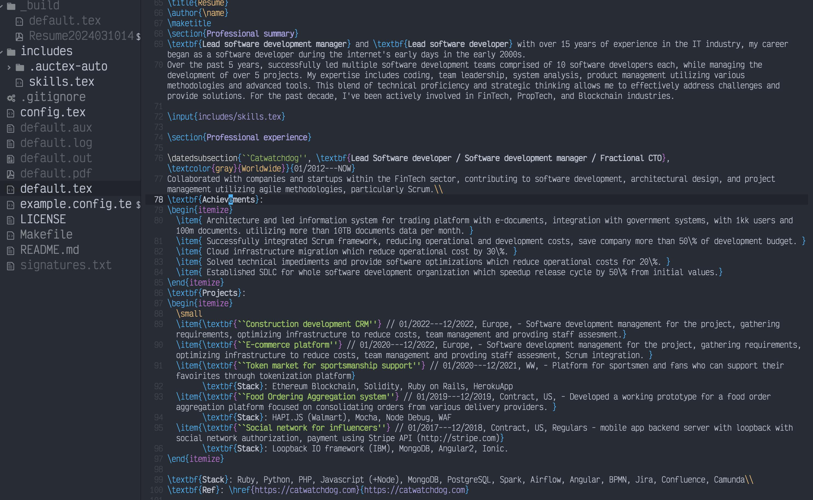
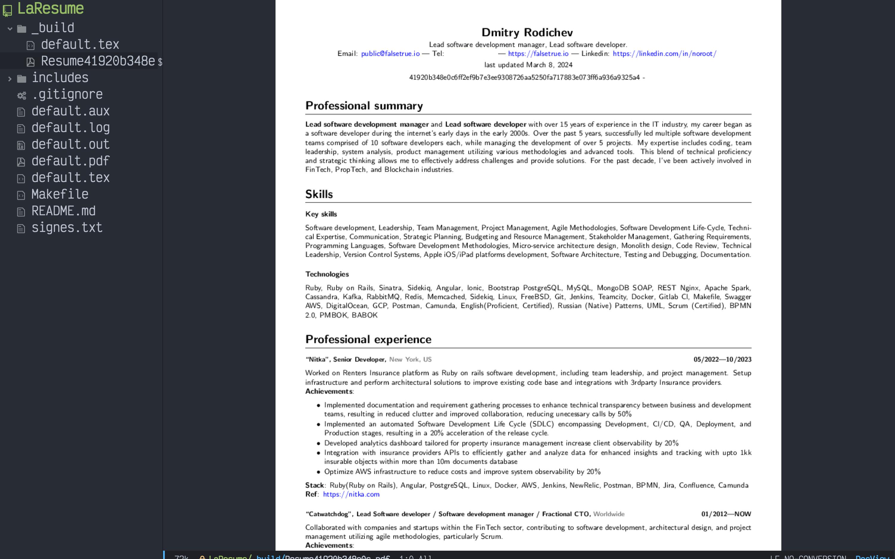

# LaResume

LaTex framework for building resume.

## Features

* Designed resume template optimized for ATS
* Generate pdf file
* Signing resume file with a hash to track resume leaks 

## Setup 
### Install dependencies

#### Linux
* Install pdflatex `apt-get install pdflatex`

#### Mac
* Install pdflatex with brew `brew cask install mactex`

#### Windows

I don't know.

## Usage

### Build
* Copy configuration template `cp example.config.tex config.tex`
* Edit configuration and set your info `emacs config.tex`
* `make build`
* open `_build/default.pdf`

### Configuration 

There are 3 files to edit
* `config.tex` - configuration strings
* `includes/skill.tex` - skills which is dynamically generated depending on role
* `default.tex` - Main file with the experiences

Inside `config.tex` you will find variables you can change 

``` tex
\def\role{ruby} % Role which case switch different skills from includes/skills.tex
\def\name{Dmitry Ro}
\def\email{public [at] falsetrue.io}
\def\site{https://github.com/noroot}
\def\linkedin{https://linkedin.com/in/noroot/}
\def\telephone{+###-###-##-###}
\def\roletitle{Lead software development manager, Lead software developer.}
```

Inside `includes/skills.tex` you'll find list of skills and keywords which can be conditioned with the role variable, so you can generate different skill set for different role in a more convenient manner.

Inside `default.tex` you'll find main body of resume with professional experiences and other sections. 

### Sign
The signature mechanism involves hashing a keyword you enter and inserting it into the document. This enables tracking back to identify who leaked your resume.

* `make sign`
* Enter signature string for hash generation
* Every sign logged into signatures.txt which is added into `.gitignore` 

### All
* Make everthing together `make all` with default values
* Open "_build/" there will be generated pdf file with the resume

## Example




## Credits

* [https://falsetrue.io](https://falsetrue.io)
* [https://catwatchdog.com](https://catwatchdog.com)

## License

* GPLv3

